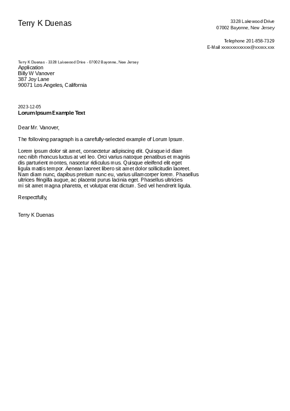

# TWML

Tailwind Markup Language is a [Markup Language](https://en.wikipedia.org/wiki/Markup_language)
that seeks to convert [TailwindCSS](https://tailwindcss.com/) into a framework for writing documents.

The syntax is inspired by [Haml](https://haml.info/) and acts as an abstracted version of HTML,
allowing for quick meta-programming.

In essence, writing TWML is like writing a website, but with fancy syntax and built-in support for TailwindCSS
using [Railwind](https://github.com/pintariching/railwind).

Although designed for websites, TailwindCSS is simple and flexible, making it perfect for documents.

```
\\ Simple letter example in TWML
\\ Note: All personal data is computer generated

\div.page.p-12.antialiased.font-sans
    \div.flex
        \p.text-2xl.m-0 Terry K Duenas
        \div.flex-1.text-right
            \span.text-sm
                3328 Lakewood Drive
                07002 Bayonne, New Jersey

                Telephone 201-858-7329
                E-Mail xxxxxxxxxxxxx@xxxxx.xxx

    \div.pt-7
        \p.text-xs.m-0 Terry K Duenas - 3328 Lakewood Drive - 07002 Bayonne, New Jersey
        \span
            Application
            Billy W Vanover
            387 Joy Lane
            90071 Los Angeles, California

    \div.pt-12
        \p.text-sm.m-0 2023-12-05
        \p.font-bold.m-0 Lorum Ipsum Example Text

    \div.pt-7
        \span
            Dear Mr. Vanover,

            The following paragraph is a carefully-selected example of Lorem Ipsum.

            Lorem ipsum dolor sit amet, consectetur adipiscing elit. Quisque id diam
            nec nibh rhoncus luctus at vel leo. Orci varius natoque penatibus et magnis
            dis parturient montes, nascetur ridiculus mus. Quisque eleifend elit eget
            ligula mattis tempor. Aenean laoreet libero sit amet dolor sollicitudin laoreet.
            Nam diam nunc, dapibus pretium nunc eu, varius ullamcorper lorem. Phasellus
            ultrices fringilla augue, ac placerat purus lacinia eget. Phasellus ultricies
            mi sit amet magna pharetra, et volutpat erat dictum. Sed vel hendrerit ligula.

            Respectfully,


            Terry K Duenas
```



_TWML converts documents to PDF using [rust-headless-chrome](https://github.com/rust-headless-chrome/rust-headless-chrome)._

## Reference

_All tailwind classes can be found at [tailwindcss.com](https://tailwindcss.com/docs)._

Adding an image:

```
@include image.png

\img{src="image.png"}
```

Basic _Hello World_:

```
\p Hello World!
\\ converted to <p>Hello World</p>
```

Simple document:

```
\p.font-3xl.font-semibold.underline Title
\span
    Content
\\ converted to <p class="font-2xl underline">Title</p><span>Content</span>
```

Underlining text:

```
\\ This is still something I have to think about.
\\ I consider simplifing this issue in the near future.
\span.flex.space-x-1
    \p This is so
    \p.underline cool
    \p !
```

Multiple pages:

```
\div.page
    \p First page

\div.page
    \p Second page
```
