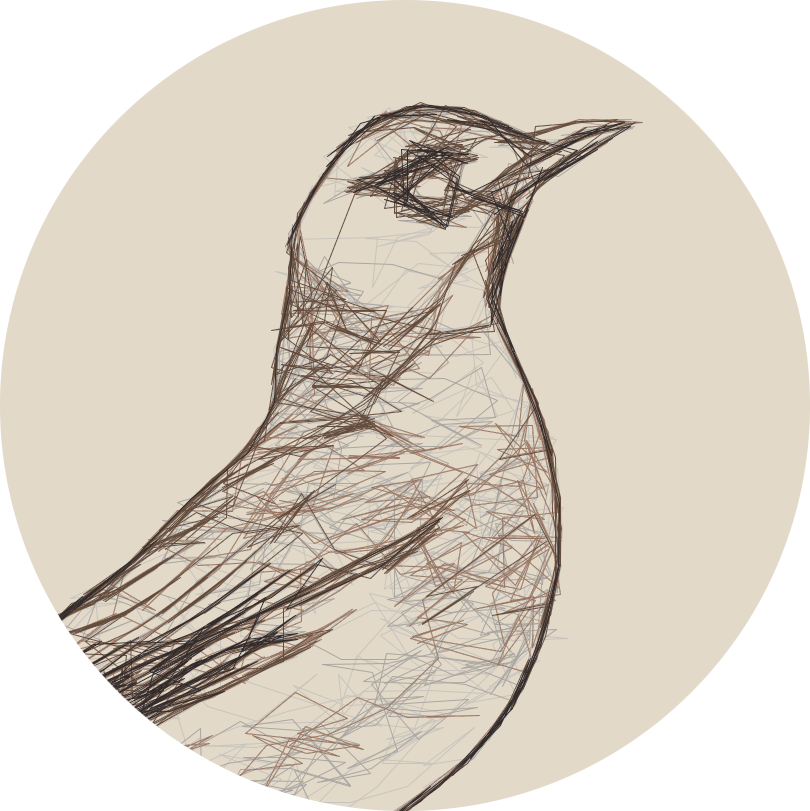
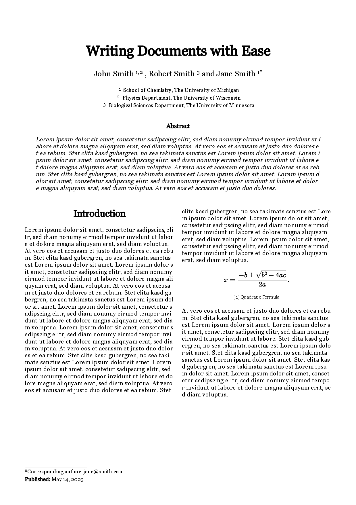

<h1 align="center">
  
  <br />
  <span>TWML</span>
</h1>

<h4 align="center">TailwindCSS-focused Template Engine, designed for Documents.</h4>

<p align="center">
  <a href="#about">About</a>
  -
  <a href="#installation">Installation</a>
  -
  <a href="https://github.com/DISTREAT/twml/blob/master/docs/dist/docs.pdf">Documentation</a>
</p>



```twml
@font Georgia
@js https://cdn.jsdelivr.net/npm/mathjax@3/es5/tex-chtml.js

\div.page.p-16.font-georgia
    \p.text-center.text-4xl.font-bold.pt-12 Writing Documents with Ease
    \p.text-center.text-xl.pt-6
        John Smith
        \span.text-sm.align-top 1,2
        , Robert Smith
        \span.text-sm.align-top 3
        and Jane Smith
        \span.text-sm.align-top 1*

    \p.text-center.text-sm.font-serif
        \span.text-xs.align-top.p-1 1
        School of Chemistry, The University of Michigan

        \span.text-xs.align-top.p-1 2
        Physics Department, The University of Wisconsin

        \span.text-xs.align-top.p-1 3
        Biological Sciences Department, The University of Minnesota

    \div.px-7
        \p.text-center.font-bold.p-4 Abstract
        \span.italic.break-all
            Lorem ipsum dolor sit amet, consetetur sadipscing elitr, sed diam nonumy eirmod tempor invidunt ut labore et dolore magna aliquyam erat, sed diam voluptua. At vero eos et accusam et justo duo dolores et ea rebum. Stet clita kasd gubergren, no sea takimata sanctus est Lorem ipsum dolor sit amet. Lorem ipsum dolor sit amet, consetetur sadipscing elitr, sed diam nonumy eirmod tempor invidunt ut labore et dolore magna aliquyam erat, sed diam voluptua. At vero eos et accusam et justo duo dolores et ea rebum. Stet clita kasd gubergren, no sea takimata sanctus est Lorem ipsum dolor sit amet. Lorem ipsum dolor sit amet, consetetur sadipscing elitr, sed diam nonumy eirmod tempor invidunt ut labore et dolore magna aliquyam erat, sed diam voluptua. At vero eos et accusam et justo duo dolores.

    \div.columns-2.gap-5.text-md.break-all.py-6
        \p.text-2xl.font-bold.pb-4.text-center Introduction
        \span
            Lorem ipsum dolor sit amet, consetetur sadipscing elitr, sed diam nonumy eirmod tempor invidunt ut labore et dolore magna aliquyam erat, sed diam voluptua. At vero eos et accusam et justo duo dolores et ea rebum. Stet clita kasd gubergren, no sea takimata sanctus est Lorem ipsum dolor sit amet. Lorem ipsum dolor sit amet, consetetur sadipscing elitr, sed diam nonumy eirmod tempor invidunt ut labore et dolore magna aliquyam erat, sed diam voluptua. At vero eos et accusam et justo duo dolores et ea rebum. Stet clita kasd gubergren, no sea takimata sanctus est Lorem ipsum dolor sit amet. Lorem ipsum dolor sit amet, consetetur sadipscing elitr, sed diam nonumy eirmod tempor invidunt ut labore et dolore magna aliquyam erat, sed diam voluptua. Lorem ipsum dolor sit amet, consetetur sadipscing elitr, sed diam nonumy eirmod tempor invidunt ut labore et dolore magna aliquyam erat, sed diam voluptua. At vero eos et accusam et justo duo dolores et ea rebum. Stet clita kasd gubergren, no sea takimata sanctus est Lorem ipsum dolor sit amet. Lorem ipsum dolor sit amet, consetetur sadipscing elitr, sed diam nonumy eirmod tempor invidunt ut labore et dolore magna aliquyam erat, sed diam voluptua. At vero eos et accusam et justo duo dolores et ea rebum. Stet clita kasd gubergren, no sea takimata sanctus est Lorem ipsum dolor sit amet. Lorem ipsum dolor sit amet, consetetur sadipscing elitr, sed diam nonumy eirmod tempor invidunt ut labore et dolore magna aliquyam erat, sed diam voluptua. Lorem ipsum dolor sit amet, consetetur sadipscing elitr, sed diam nonumy eirmod tempor invidunt ut labore et dolore magna aliquyam erat, sed diam voluptua.
            $$x = {-b \pm \sqrt{b^2-4ac} \over 2a}.$$
            \p.text-center.text-xs [1] Quadratic Formula

            At vero eos et accusam et justo duo dolores et ea rebum. Stet clita kasd gubergren, no sea takimata sanctus est Lorem ipsum dolor sit amet. Lorem ipsum dolor sit amet, consetetur sadipscing elitr, sed diam nonumy eirmod tempor invidunt ut labore. Stet clita kasd gubergren, no sea takimata sanctus est Lorem ipsum dolor sit amet. Stet clita kasd gubergren, no sea takimata sanctus est Lorem ipsum dolor sit amet. Stet clita kasd gubergren, no sea takimata sanctus est Lorem ipsum dolor sit amet. Lorem ipsum dolor sit amet, consetetur sadipscing elitr, sed diam nonumy eirmod tempor invidunt ut labore et dolore magna aliquyam erat, sed diam voluptua.

    \div.absolute.bottom-14
        \hr.w-40.line
        \span.text-sm
            *Corresponding author: jane@smith.com

            \span.font-bold Published:
            May 14, 2023
```

_The example is inspired by this [LaTeX template](https://www.latextemplates.com/template/journal-article)._

## About

_Tailwind Markup Language_ is a [Markup Language](https://en.wikipedia.org/wiki/Markup_language)
and _Template Engine_ that seeks to convert [TailwindCSS](https://tailwindcss.com/) into a framework
for writing documents.

The syntax is inspired by [Haml](https://haml.info/) and acts as an abstracted version of HTML.

In essence, writing TWML is like writing HTML with built-in support for TailwindCSS using
[Railwind](https://github.com/pintariching/railwind).

TailwindCSS is simple and flexible, making it perfect for documents.

## Installation

Compile and install from `master`:

```
cargo install --git https://github.com/DISTREAT/twml
```

Compiled binaries can be found [here](https://github.com/DISTREAT/twml/releases).
